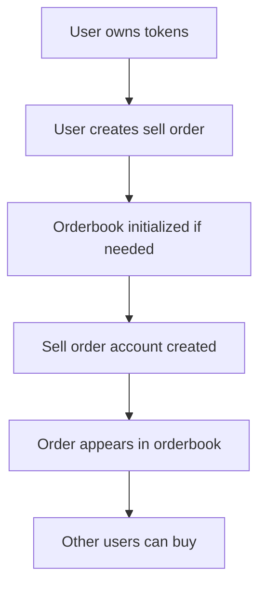

# 📋 How to View the Orderbook - Complete Guide

Your DeFi trading platform has a sophisticated orderbook system for trading company shares. Here's everything you need to know about viewing and understanding the orderbook.

## 🎯 Quick Summary

**Current Status of Your Platform:**
- ✅ **1 Company registered**: "Test Company" (TEST symbol)
- ✅ **2 User portfolios created**: Ready for trading
- ❌ **0 Active orderbooks**: Will be created when first sell order is placed
- ❌ **0 Sell orders**: No tokens are currently for sale
- ❌ **0 Completed trades**: No trading activity yet

## 🔍 How to View the Orderbook

### Method 1: Comprehensive Orderbook Viewer (Recommended)

```bash
cd /home/rahul/projects/defi_trading_platform
ANCHOR_PROVIDER_URL=http://localhost:8899 ANCHOR_WALLET=~/.config/solana/id.json node scripts/view_orderbook_simple.js
```

**What it shows:**
- 📊 Platform statistics (companies, trades, offerings)
- 🏢 All registered companies with details
- 📋 Orderbook status for each company
- 💰 Active sell orders with prices and quantities
- 👥 User portfolios and balances

### Method 2: Detailed Demonstration

```bash
cd /home/rahul/projects/defi_trading_platform
ANCHOR_PROVIDER_URL=http://localhost:8899 ANCHOR_WALLET=~/.config/solana/id.json node scripts/demo_orderbook.js
```

**What it shows:**
- 🚀 Step-by-step orderbook analysis
- 📈 Market statistics when orders exist
- 💡 Actionable next steps

### Method 3: Account Scanner

```bash
node scripts/orderbook_scanner.js
```

**What it shows:**
- 🔍 Low-level account detection
- 📋 Raw account data parsing
- 🛠 Technical debugging information

## 📋 Understanding the Orderbook Structure

### Account Hierarchy

```
DeFi Trading Platform
├── Platform Account (Global stats)
├── Company Accounts (1 found)
│   ├── Company: "Test Company" (TEST)
│   │   ├── Token Mint: BWtDs1seGr6feggd5YCSHJS7oKAVHiDJWeqAMZJTocbk
│   │   ├── Orderbook: QTCyKGWwXJh5GEnyqV2kcfEb32WnUFvo84dLYz7d1FP (not yet created)
│   │   └── Sell Orders: (none yet)
└── User Portfolios (2 found)
    ├── Portfolio 1: AzipqiPMrg7DBVVMML1fSv6gSNXtHoGE1YwgdHD4UuEi
    └── Portfolio 2: B4js8ddGfLfPCEHTAiHhKXFr98gL5b5iGqSxfCeT9zC8
```

### Key Addresses in Your Platform

| Component | Address | Status |
|-----------|---------|--------|
| **Program ID** | `FATJAGZjRCzP6uYLCpUdbgE5fUZxjrzPCU6dagp6iH7z` | ✅ Active |
| **Platform** | Auto-generated PDA | ✅ Initialized |
| **Test Company** | `9HHYfTjybz18GWf1ovArg3Hxas1F3n2kFfc8P3QANBqX` | ✅ Registered |
| **Company Token Mint** | `BWtDs1seGr6feggd5YCSHJS7oKAVHiDJWeqAMZJTocbk` | ✅ Created |
| **Expected Orderbook** | `QTCyKGWwXJh5GEnyqV2kcfEb32WnUFvo84dLYz7d1FP` | ❌ Not yet created |

## 💰 How the Orderbook Works

### 1. Sell Order Placement Process



### 2. Order Information Structure

Each sell order contains:
- **Order ID**: Unique identifier
- **Seller**: User who placed the order  
- **Company**: Which company's shares
- **Quantity**: Number of shares for sale
- **Price per Share**: Price in lamports (1 SOL = 1,000,000,000 lamports)
- **Active Status**: Whether order can be purchased
- **Created Time**: When order was placed

### 3. Example Order Display

```
💰 Active Sell Orders: 3

  Order 1:
    Order ID: 1
    Seller: 7NMJsk55Z1PEcr9xqGFgUSRuHUcCZUk1aVbsndmG4hEt
    Quantity: 100 shares
    Price: 0.500000 SOL per share
    Total Value: 50.000000 SOL
    Active: true
    Created: 10/6/2025, 3:42:10 PM
```

## 🚀 Creating Active Orders (Next Steps)

Since your orderbook is currently empty, here's how to populate it:

### Option 1: Run Full Test Suite
```bash
anchor test --skip-local-validator
```
This will:
- ✅ Create users with tokens
- ✅ Place sample sell orders
- ✅ Show orderbook in action

### Option 2: Manual Order Creation

1. **Users participate in token offerings**:
   - Get tokens from the company
   - Build token balances

2. **Users place sell orders**:
   ```javascript
   await program.methods
     .createSellOrder(quantity, pricePerShare)
     .accounts({ /* accounts */ })
     .rpc();
   ```

3. **Orderbook automatically populates**:
   - First order creates the orderbook
   - Subsequent orders add to it

## 📊 Market Data When Active

Once orders exist, you'll see:

- **📈 Price Discovery**: Range of prices users are asking
- **📊 Volume Analysis**: Total shares available for purchase  
- **💹 Market Depth**: Distribution of orders across price levels
- **🕒 Order History**: When orders were placed
- **👥 Participant Activity**: Which users are buying/selling

## 🛠 Advanced Viewing Options

### Via Solana CLI
```bash
# View specific account
solana account 9HHYfTjybz18GWf1ovArg3Hxas1F3n2kFfc8P3QANBqX --output json

# List all program accounts  
solana program show FATJAGZjRCzP6uYLCpUdbgE5fUZxjrzPCU6dagp6iH7z
```

### Via Solana Explorer
1. Go to https://explorer.solana.com
2. Set custom RPC: `http://localhost:8899`
3. Search for account addresses above

## 🎯 Current State Summary

Your DeFi platform is **ready for orderbook activity** but needs users to:

1. ✅ **Platform initialized** - Core infrastructure working
2. ✅ **Company registered** - "Test Company" ready for trading
3. ✅ **User portfolios created** - 2 users ready to trade
4. ❌ **Need token distribution** - Users need tokens to sell
5. ❌ **Need sell orders** - Users need to place orders
6. ❌ **Need trading activity** - Users need to buy/sell

The orderbook system is **fully implemented and functional** - it just needs trading activity to become visible!

## 💡 Pro Tips

- **Real-time monitoring**: Run the viewer scripts periodically to watch orderbook changes
- **Price analysis**: Compare prices across different sell orders to find best deals
- **Volume tracking**: Monitor total value of orders to gauge market activity
- **User behavior**: Watch which portfolios are most active in trading

Your orderbook is the heart of price discovery in your DeFi platform! 🚀